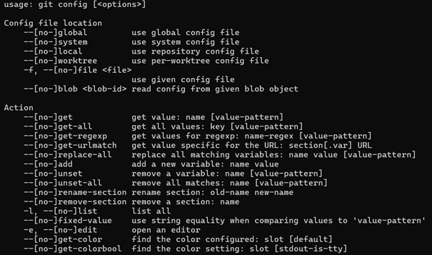
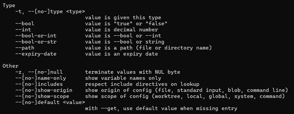
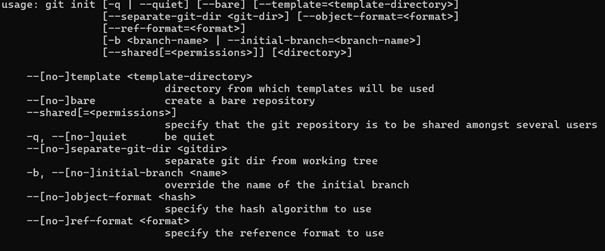
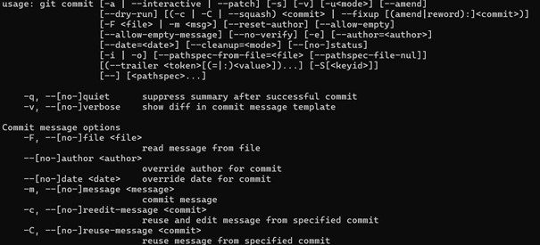
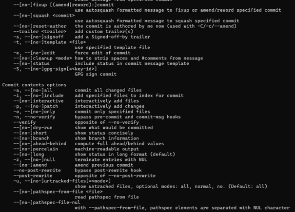
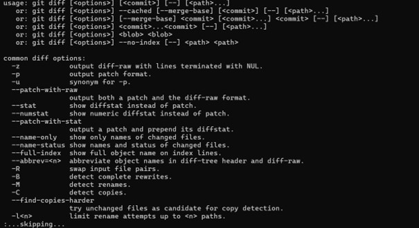
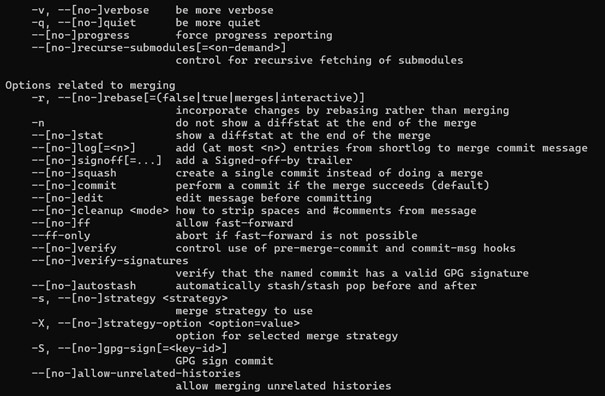
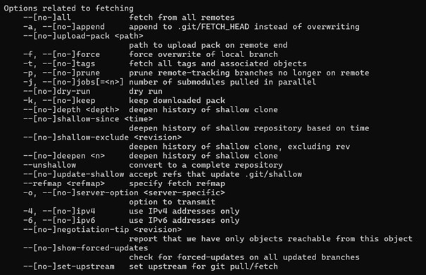

git config:
Use:
Wird benutzt, um die Einstellungen global als auch innerhalb eines Repositories zu verändern bzw. anzuschauen.
Mögliche Parameter:

 
 
Betroffene Daten:
Meta-Informationen wie Benutzername, E-Mail-Adresse und Konfigurationseinstellungen.
 
Änderungsort:
Die Konfigurationsdateien können lokal (für das aktuelle Repository) oder global (für alle Git-Repositories auf dem System) geändert werden.

git init:
Use:
Wird benutzt, um ein neues Git-Repository zu initialisieren.
Mögliche Parameter:

Keine Parameter erforderlich, aber es gibt ein paar:
 Betroffene Daten:
Das aktuelle Verzeichnis
Änderungsort:
Lokal im Arbeitsverzeichnis

git commit:
Use:
Mit diesem Befehl werden Änderungen im Arbeitsverzeichnis in das Git-Repository übernommen und in der Historie des Projekts festgehalten.
Mögliche Parameter:
Keine Parameter erforderlich, aber es gibt ein paar:

 
 
 
Betroffene Daten:
Das aktuelle Verzeichnis
Änderungsort:
Lokal im Repository
 
git status:
Use:
Dieser Befehl zeigt den Zustand des Arbeitsverzeichnisses an. Er informiert darüber, welche Dateien geändert, hinzugefügt oder gelöscht wurden und welche noch nicht für den Commit vorgemerkt sind.
Mögliche Parameter:
Keine Parameter erforderlich
Betroffene Daten:
Meta-Informationen über den Status der Dateien im Arbeitsverzeichnis
Änderungsort:
Keine Änderungen, zeigt nur Informationen.

git add:
Use:
Mit diesem Befehl werden Änderungen im Arbeitsverzeichnis zum Staging-Bereich hinzugefügt, um sie für den nächsten Commit vorzubereiten.
Mögliche Parameter:
Keine Parameter erforderlich, aber es können Dateinamen oder Verzeichnisse angegeben werden
Betroffene Daten:
Die Dateien, die zum Staging-Bereich hinzugefügt werden sollen.
Änderungsort:
Die Änderungen werden lokal im Staging-Bereich vorgenommen.

git log:
Use:
Dieser Befehl zeigt die Historie der Commits im Repository an. 
Mögliche Parameter:
Keine Parameter erforderlich, aber es können Dateinamen oder Verzeichnisse angegeben werden
Betroffene Daten:
Informationen über vergangene Commits im Repository.
Änderungsort:
Keine

git diff:
Use:
Mit diesem Befehl können die Unterschiede zwischen den Arbeitskopien und den Staging-Bereichen oder zwischen verschiedenen Commits angezeigt werden.
Mögliche Parameter:

 Betroffene Daten:
Die Unterschiede zwischen den verschiedenen Versionen der Dateien im Repository.
Änderungsort:
Keine
 
git pull:
Use:
Dieser Befehl holt Änderungen von einem entfernten Repository und führt ein Zusammenführen mit dem lokalen Branch durch.
Mögliche Parameter:

 
 
 
Betroffene Daten:
Die Änderungen, die aus dem entfernten Repository geholt werden.
Änderungsort:
Die Änderungen werden lokal im Arbeitsverzeichnis zusammengeführt.

 
git push:
Use:
Mit diesem Befehl werden lokale Commits zum entfernten Repository hochgeladen.
Mögliche Parameter:
 
Betroffene Daten:
Die lokalen Commits, die zum entfernten Repository hochgeladen werden sollen.
Änderungsort:
Die Änderungen werden auf dem entfernten Server im Repository durchgeführt.

Tabelle:

| Produkt      | Kosten | Herstellungsland |
|-----------|-------|-------------|
| PC | 500 | China |
| Webcam   | 25 | Niederlande |
| Cocktailmixer | 72 | Deutschland |