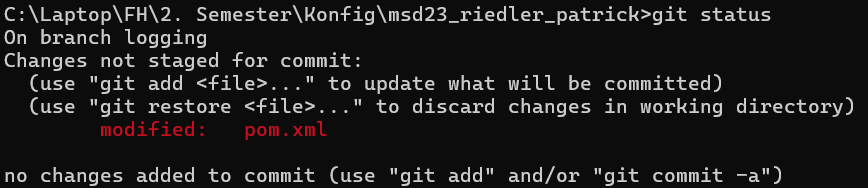
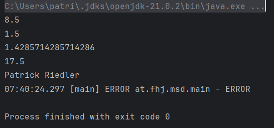
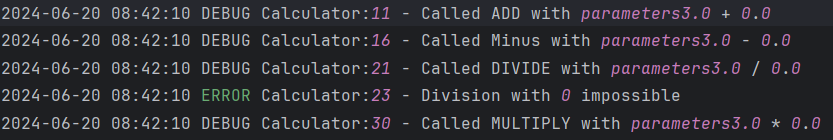
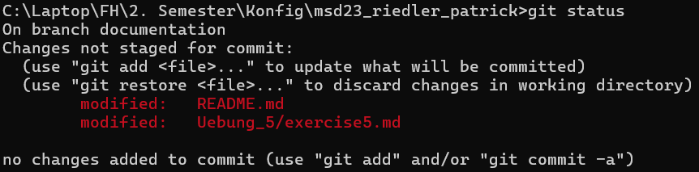

Übung 5:

Logging Branch status:

Auffälligkeiten:

Der Output der Konsole beinhaltet nur den logger.errror und nicht de logger.info text.

# Projektkonfiguration

## Log4j2 Konfiguration

Um sicherzustellen, dass Logs korrekt in einer Datei gespeichert werden, stellen Sie sicher, dass die Log4j2-Konfigurationsdatei an der richtigen Stelle und mit dem richtigen Namen vorhanden ist.

1. Platzieren Sie die `log4j2.xml` Datei im Verzeichnis `src/main/resources`.
2. Benennen Sie die Datei exakt `log4j2.xml`.

Ein Template für diese Datei finden Sie unter `log4j2.xml.template`. Kopieren Sie diese Datei und benennen Sie sie in `log4j2.xml` um, bevor Sie das Projekt ausführen.

Outputdatei:

Documentation:

# Logging Bibliotheken

## Warum werden Logging Bibliotheken verwendet?

Logging Bibliotheken werden verwendet, um Ereignisse in Softwareanwendungen zu protokollieren. Dies hilft Entwicklern, die Ausführung der Anwendung zu überwachen, Fehler zu identifizieren und die Leistung zu analysieren. Durch Logging können wichtige Informationen wie Fehler, Warnungen und allgemeine Betriebsdaten gesammelt werden, was bei der Fehlerbehebung und Verbesserung der Anwendung hilfreich ist.

## Welche Loglevel gibt es in Log4J und was hat es damit auf sich?

Log4J bietet verschiedene Loglevel, die jeweils eine unterschiedliche Priorität haben:

- **TRACE**: Sehr detaillierte Informationen, die hauptsächlich für die Fehlersuche verwendet werden.
- **DEBUG**: Detaillierte Informationen, die für die Diagnose während der Entwicklung nützlich sind.
- **INFO**: Allgemeine Informationen über den normalen Betrieb der Anwendung.
- **WARN**: Warnungen über potenzielle Probleme, die nicht sofortige Aufmerksamkeit erfordern, aber überwacht werden sollten.
- **ERROR**: Fehler, die die Anwendung nicht zum Absturz bringen, aber Aufmerksamkeit erfordern.
- **FATAL**: Kritische Fehler, die zum Absturz der Anwendung führen können.

## Was für Konfigurationsmöglichkeiten bietet Ihnen Log4J?

Log4J bietet eine Vielzahl von Konfigurationsmöglichkeiten, einschließlich:

- **Appenders**: Bestimmen, wohin die Logdaten geschrieben werden sollen (z.B. Datei, Konsole, Datenbank).
- **Layouts**: Definieren das Format der Lognachrichten.
- **Loggers**: Ermöglichen das Konfigurieren von Logleveln für verschiedene Teile der Anwendung.
- **Filters**: Bieten zusätzliche Kontrolle darüber, welche Lognachrichten weitergegeben werden.

Documentation branch status:

